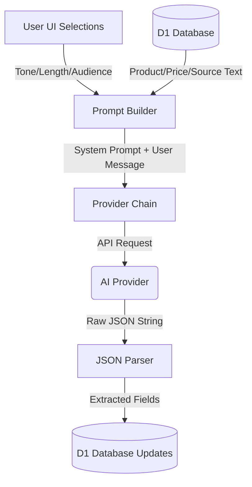

<details>
<summary>Relevant source files</summary>

The following files were used as context for generating this wiki page:

- [shared/prompts.ts](shared/prompts.ts)
- [engine/src/index.ts](engine/src/index.ts)
- [shared/providers.ts](shared/providers.ts)
- [app/public/app.js](app/public/app.js)
- [app/public/index.html](app/public/index.html)
</details>

# LLM Prompts & Instructions

The LLM Prompts & Instructions system is a centralized logic module responsible for generating high-quality product descriptions and motivations. It utilizes a structured prompting strategy that combines a base system prompt with user-configurable parameters such as tone, length, and target audience to ensure consistent AI behavior across different providers.

The system is designed to be provider-agnostic, supporting models from Anthropic, OpenAI, Google (Gemini), and Azure OpenAI. It strictly enforces a JSON output format to allow the application to programmatically parse and store the generated enrichment data in the project's D1 database.

## System Prompt Architecture

The system prompt is constructed dynamically through the `buildSystemPrompt` function. It establishes the "persona" of the AI as an assistant writing short product descriptions in Swedish and provides strict constraints on the output format.

### Core Instructions
The base prompt defines the following rules for the LLM:
*  **Format:** Responses must be valid JSON only, without markdown code fences or extra text.
*  **Structure:** The JSON must contain two keys: `beskrivning` (1-2 sentences of natural description) and `varför` (1-2 sentences on why the product is needed).
*  **Grounding:** Descriptions must be based solely on provided "Product Info" or "Category" data; the LLM is prohibited from inventing features.

Sources: [shared/prompts.ts:11-19](shared/prompts.ts#L11-L19), [shared/providers.ts:145-161](shared/providers.ts#L145-L161)

### Prompt Customization
Users can influence the output through specific options defined in the UI and processed in the shared prompt logic.

| Configuration | Options | Logic / Instruction |
| :--- | :--- | :--- |
| **Tone** | Saklig, Entusiastisk, Humoristisk, Lyxig | Appends specific stylistic instructions (e.g., "Håll tonen saklig" or "exklusiv, premium känsla"). |
| **Length** | Kort, Medel, Lång | Sets sentence limits (Kort: 1 sentence, Medel: 1-2, Lång: up to 3). |
| **Audience** | User-defined text | Injects a directive to adapt the "motivation" field for that specific target group. |
| **Custom Direction**| User-defined text | Appends an "Extra instruktion" block at the end of the system prompt. |

Sources: [shared/prompts.ts:21-55](shared/prompts.ts#L21-L55), [app/public/index.html:105-125](app/public/index.html#L105-L125)

## Data Flow & Processing

The following diagram illustrates how user selections and product data are transformed into an LLM request and subsequently parsed back into the application state.



*The flow demonstrates the transition from user inputs and database context to AI generation and finally to data enrichment in D1.*
Sources: [shared/prompts.ts](shared/prompts.ts), [engine/src/index.ts:384-415](engine/src/index.ts#L384-L415), [shared/providers.ts:173-195](shared/providers.ts#L173-L195)

## Prompt Execution Logic

The application executes prompts in two main contexts: background cron jobs for catalog enrichment and on-demand generation for specific user actions.

### User Message Construction
The `userMessage` function formats the context for the LLM by combining available product metadata into a structured text block. This ensures the model has all necessary grounding data.

```typescript
export function userMessage(
  site: string,
  product: string,
  price: string,
  category = "",
  sourceText = "",
): string {
  const lines = [`Produkt: ${product}`];
  if (category.trim()) lines.push(`Kategori: ${category.trim()}`);
  if (sourceText.trim()) lines.push(`Produktinfo: ${sourceText.trim()}`);
  lines.push(`Butik: ${site}`);
  lines.push(`Pris: ${price} kr`);
  return lines.join("\n");
}
```

Sources: [shared/prompts.ts:57-71](shared/prompts.ts#L57-L71)

### Parsing and Validation
Since LLMs can sometimes include conversational filler, the system uses a regex-based parser (`parseDescriptionResponse`) to isolate the JSON block within the response. This increases robustness against non-compliant AI models.

```typescript
const JSON_BLOCK = /\{[\s\S]*\}/;

export function parseDescriptionResponse(content: string): { beskrivning: string; varför: string } {
  const text = (content ?? "").trim();
  const match = JSON_BLOCK.exec(text);
  if (match) {
    try {
      const data = JSON.parse(match[0]);
      return {
        beskrivning: String(data.beskrivning ?? "").trim(),
        varför: String(data.varför ?? data.varfor ?? "").trim(),
      };
    } catch { /* fallback to text if JSON fails */ }
  }
  return { beskrivning: text, varför: "" };
}
```

Sources: [shared/providers.ts:143-162](shared/providers.ts#L143-L162)

## Error Handling and Rate Limiting
The prompt system is integrated with a `ProviderChain` that handles failures gracefully. If an LLM fails to provide a description or hits a rate limit, the system can attempt to failover to a different configured provider.

*  **Rate Limits:** Captured via `RateLimitExceeded`.
*  **Exhaustion:** If all providers (Anthropic, OpenAI, etc.) are exhausted, an `AllProvidersExhausted` error is thrown with a `resumeAt` timestamp.
*  **Validation Errors:** Handled by `friendlyDescribeError` in the UI to provide readable feedback (e.g., "AI-kvoten är slut" or "ogiltig API-nyckel").

Sources: [shared/providers.ts:10-25](shared/providers.ts#L10-L25), [app/public/app.js:283-294](app/public/app.js#L283-L294), [engine/src/index.ts:405-416](engine/src/index.ts#L405-L416)

## Summary
The LLM Prompts & Instructions module provides a robust, typed interface for AI interaction. By strictly separating system instructions from product context and enforcing JSON output, the system maintains high data integrity within the catalog. The inclusion of user-steered parameters allows for diverse content generation while the provider chain ensures maximum availability of the enrichment service.
