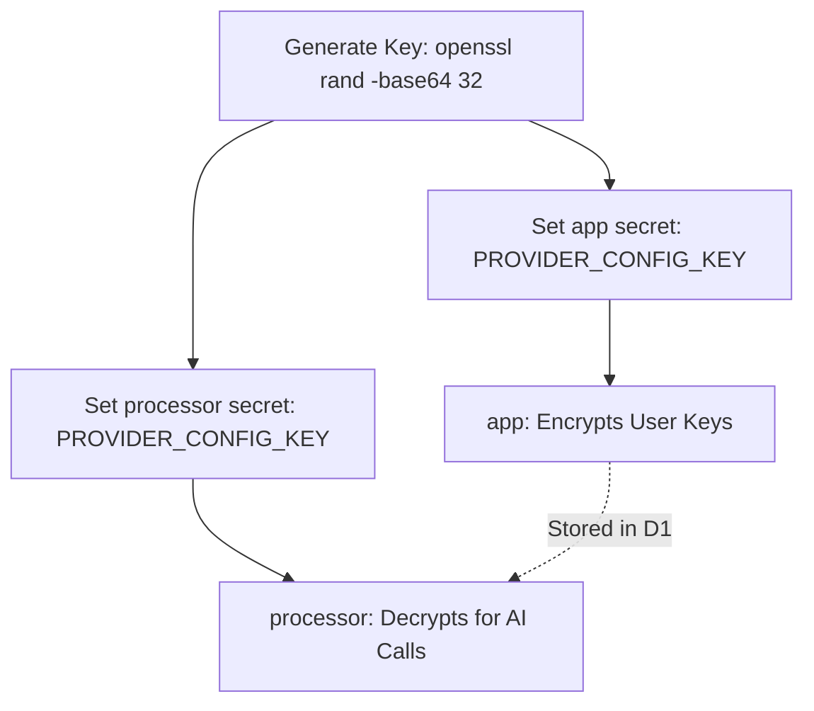
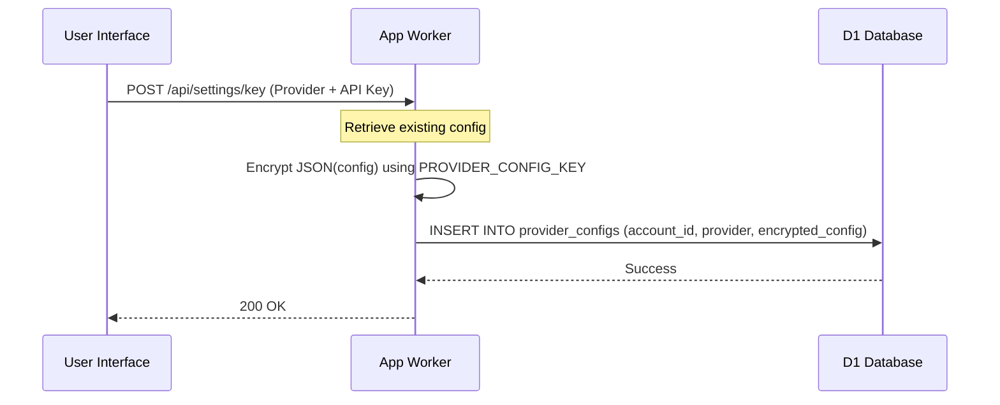
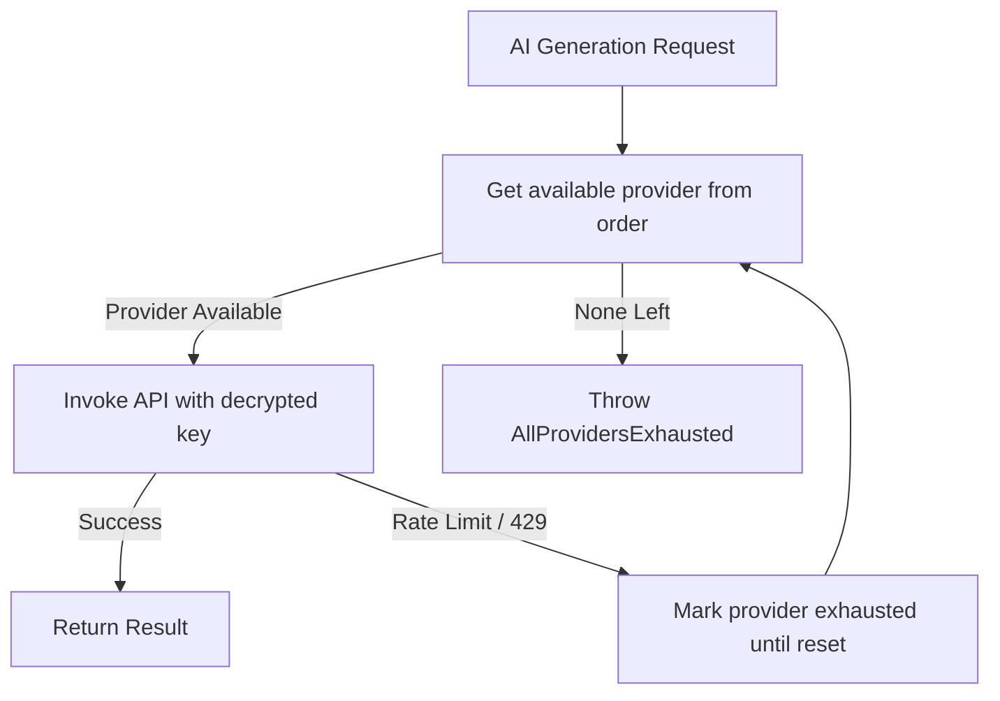

<details>
<summary>Relevant source files</summary>

The following files were used as context for generating this wiki page:

- [shared/provider-config.ts](shared/provider-config.ts)
- [SECURITY.md](SECURITY.md)
- [shared/providers.ts](shared/providers.ts)
- [README.md](README.md)
- [app/src/index.ts](app/src/index.ts)
- [processor/package.json](processor/package.json)
- [app/package.json](app/package.json)
</details>

# Encrypted Provider Configurations

Encrypted Provider Configurations represent the system used to securely store and manage AI service provider credentials (such as API keys for Anthropic, OpenAI, Gemini, and Azure OpenAI) within the Product Describer project. This system ensures that sensitive tokens are never stored in plaintext within the database or committed to version control, using industry-standard encryption to protect user and operator secrets.

The architecture relies on a shared master key, `PROVIDER_CONFIG_KEY`, which must be synchronized between the `app` and `processor` Workers to allow one to encrypt and the other to decrypt configuration data. This mechanism supports multi-provider failover and user-specific AI keys, enabling the platform to remain cost-effective while providing robust AI-generated descriptions.

Sources: [SECURITY.md:12-16](SECURITY.md#L12-L16), [README.md:4-10](README.md#L4-L10), [shared/provider-config.ts:1-10](shared/provider-config.ts#L1-L10)

## Security Architecture

The security model is built on the principle that raw provider credentials should never be logged, echoed, or committed. Instead, all configurations are stored encrypted in Cloudflare D1.

### Master Key Management
The system uses a 32-byte master key generated via OpenSSL and managed as a Cloudflare Worker secret. This key is critical for the AES-GCM encryption process.



Sources: [README.md:48-55](README.md#L48-L55), [SECURITY.md:12-16](SECURITY.md#L12-L16), [app/package.json:8](app/package.json#L8)

### Encryption Mechanism
The project uses AES-GCM via the Web Crypto API. Configurations are serialized to JSON, encrypted, and then stored in the `provider_configs` table.

| Component | Description |
| :--- | :--- |
| **Algorithm** | AES-GCM (implemented via `shared/crypto.ts`) |
| **Storage** | Cloudflare D1 Database |
| **Key Type** | Cloudflare Worker Secret (`PROVIDER_CONFIG_KEY`) |
| **Scope** | Per-account and per-provider |

Sources: [shared/provider-config.ts:4-8](shared/provider-config.ts#L4-L8), [SECURITY.md:15](SECURITY.md#L15)

## Provider Configuration Workflow

The system manages multiple AI providers and their specific credential requirements. While most providers only require an API key, others like Azure OpenAI require additional metadata.

### Configuration Lifecycle
The following sequence shows how a user interacts with the provider settings in the UI.



Sources: [shared/provider-config.ts:50-70](shared/provider-config.ts#L50-L70), [app/src/index.ts:251-267](app/src/index.ts#L251-L267)

### Supported Providers and Fields
Different providers require different configuration fields, defined in the `EXTRA_FIELDS` mapping.

| Provider | Required Fields | Default Model |
| :--- | :--- | :--- |
| **Anthropic** | `api_key` | `claude-sonnet-4-6` |
| **OpenAI** | `api_key` | `gpt-4.1-mini` |
| **Gemini** | `api_key` | `gemini-2.5-flash` |
| **Azure OpenAI** | `api_key`, `endpoint`, `deployment` | (Deployment-specific) |

Sources: [shared/provider-config.ts:18-32](shared/provider-config.ts#L18-L32), [shared/providers.ts:35-40](shared/providers.ts#L35-L40)

## Failover and Chain Execution

To ensure reliability, the system supports a `ProviderChain`. This allows the application to attempt calls using multiple providers in a specific order if one fails due to rate limits or billing exhaustion.

### The Provider Chain
The `ProviderChain` class manages a list of `ProviderSpec` objects. When an AI call is made, the chain iterates through configured providers until one succeeds or all are exhausted.



Sources: [shared/providers.ts:168-200](shared/providers.ts#L168-L200), [shared/provider-config.ts:114-126](shared/provider-config.ts#L114-L126)

### Configuration Retrieval and Decryption
The `buildChain` function is the primary entry point for the `processor` or `engine` to prepare for AI operations.

```typescript
export async function buildChain(env: ProviderConfigEnv, accountId: string): Promise<ProviderChain | null> {
  const order = await getOrder(env, accountId);
  const specs: ProviderSpec[] = [];
  for (const entry of order) {
    const config = await getProviderConfig(env, accountId, entry.provider);
    if (!isProviderReady(entry.provider, config)) continue;
    const creds: ProviderCreds = { apiKey: config.api_key, endpoint: config.endpoint, deployment: config.deployment };
    specs.push({ provider: entry.provider, creds, model: entry.model });
  }
  if (specs.length === 0) return null;
  return new ProviderChain(specs);
}
```

Sources: [shared/provider-config.ts:114-126](shared/provider-config.ts#L114-L126)

## Database Schema

The provider configurations are stored across two main tables in D1 to separate the credentials from the user's preferred execution order.

### Table: `provider_configs`
Stores the actual encrypted credentials.
| Field | Type | Description |
| :--- | :--- | :--- |
| `account_id` | TEXT | Reference to the user account |
| `provider` | TEXT | Provider name (e.g., 'anthropic') |
| `encrypted_config` | TEXT | AES-GCM encrypted JSON string |

### Table: `provider_order`
Stores the user's preferred failover order for AI providers.
| Field | Type | Description |
| :--- | :--- | :--- |
| `account_id` | TEXT | Primary Key |
| `order_json` | TEXT | JSON array of `OrderEntry` (provider + model) |

Sources: [shared/provider-config.ts:50-112](shared/provider-config.ts#L50-L112)

## Summary

The Encrypted Provider Configuration system provides a secure, flexible way to manage AI API keys in a serverless environment. By utilizing Cloudflare Worker secrets for master keys and D1 for per-user encrypted storage, it balances the need for high-security credential handling with the multi-provider failover capabilities required for a robust production AI service.

Sources: [SECURITY.md:12-16](SECURITY.md#L12-L16), [shared/provider-config.ts:1-10](shared/provider-config.ts#L1-L10), [README.md:5-10](README.md#L5-L10)
