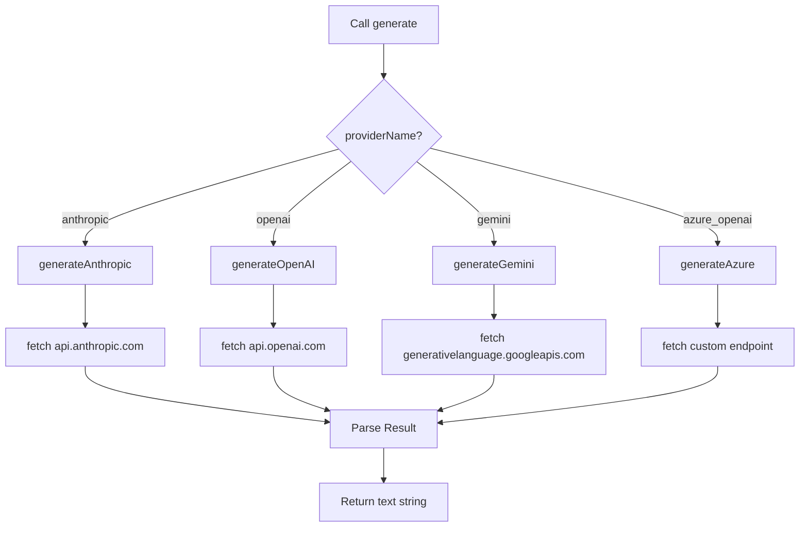
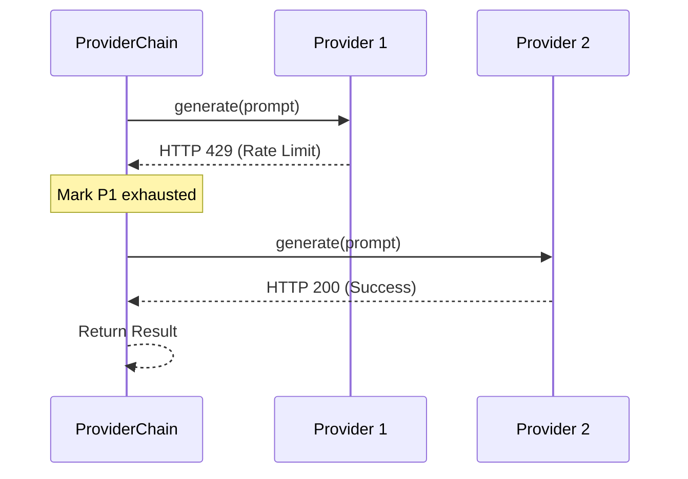
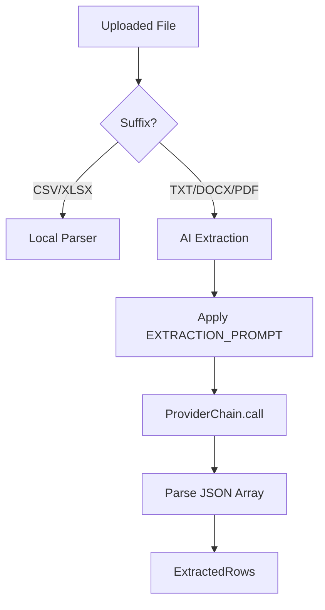

Relevant source files

The following files were used as context for generating this wiki page:

- [shared/providers.ts](shared/providers.ts)
- [engine/src/index.ts](engine/src/index.ts)
- [infra/schema.sql](infra/schema.sql)
- [processor/src/extractors.ts](processor/src/extractors.ts)
- [SECURITY.md](SECURITY.md)
- [README.md](README.md)

# Supported AI Providers

## Introduction
The Product Describer project utilizes multiple Artificial Intelligence (AI) providers to perform core functions such as generating product descriptions from source text and extracting structured product data from unstructured files (PDF, DOCX, TXT). Due to the constraints of the Cloudflare Workers runtime, which does not support official AI provider SDKs, all interactions are implemented using raw `fetch()` calls against the providers' REST APIs.

Sources: [shared/providers.ts:1-7](shared/providers.ts#L1-L7), [README.md:12-14](README.md#L12-L14), [processor/src/extractors.ts:6-10](processor/src/extractors.ts#L6-L10)

The system is designed for high availability and cost-efficiency by implementing a "Provider Chain" that supports failover and rate-limit handling. Providers can be configured at an account level for individual users or at an operator level for system-wide background tasks.

Sources: [shared/providers.ts:153-157](shared/providers.ts#L153-L157), [engine/src/index.ts:31-41](engine/src/index.ts#L31-L41)

## Supported Provider Architectures
The project integrates four primary AI providers. Each implementation handles specific request/response formats and authentication headers required by the respective REST API.

| Provider | Authentication Method | Default Models |
| :--- | :--- | :--- |
| **Anthropic** | `x-api-key` header | `claude-sonnet-4-6`, `claude-haiku-4-5-20251001`, `claude-opus-4-8` |
| **OpenAI** | `Authorization: Bearer` | `gpt-4.1`, `gpt-4.1-mini`, `gpt-4o` |
| **Google Gemini**| URL Query Parameter (`key=`) | `gemini-2.5-flash`, `gemini-2.5-flash-lite`, `gemini-2.5-pro` |
| **Azure OpenAI** | `api-key` header | Configured via deployment name |

Sources: [shared/providers.ts:40-52](shared/providers.ts#L40-L52), [shared/providers.ts:74-124](shared/providers.ts#L74-L124)

### Implementation Logic
The following diagram illustrates how the `generate` function routes requests to specific provider implementations based on the `ProviderName`.

The implementation ensures that large text inputs are sanitized and that provider-specific response structures (like Anthropic's `content` array or OpenAI's `choices` array) are flattened into a standard string response.

Sources: [shared/providers.ts:58-124](shared/providers.ts#L58-L124)

## Provider Chain and Failover Logic
To manage rate limits and ensure continuous operation, the `ProviderChain` class manages a prioritized list of `ProviderSpec` objects. If a provider returns a rate limit error (HTTP 429) or indicates exhausted billing, the system automatically marks that provider as unavailable and attempts the next one in the chain.

Sources: [shared/providers.ts:153-195](shared/providers.ts#L153-L195)

### Error Handling & Rate Limiting
The system categorizes errors into retriable rate limits and fatal API errors.
*  **Rate Limit Exceeded:** Triggered by HTTP 429 or specific "billing exhausted" phrases in the error body.
*  **Billing Phrases:** Phrases like "credit balance", "insufficient_quota", and "billing" are detected to prevent repeated failed calls to empty accounts.
*  **Retry Logic:** If a `retry-after` header is absent during a billing error, the system defaults to a 6-hour wait period.

Sources: [shared/providers.ts:21-36](shared/providers.ts#L21-L36), [shared/providers.ts:126-135](shared/providers.ts#L126-L135)

Sources: [shared/providers.ts:175-194](shared/providers.ts#L175-L194)

## Data Extraction Usage
Providers are heavily utilized during the file extraction phase in `processor/src/extractors.ts`. When a user uploads a `.txt`, `.docx`, or `.pdf`, the text is extracted and passed to the AI with a specific `EXTRACTION_PROMPT`.

### Extraction Prompt Specification
The AI is instructed to:
1.  Identify every product mentioned in the text.
2.  Output ONLY a valid JSON array.
3.  Include fields: `Product`, `Site`, and `Price (SEK)`.

Sources: [processor/src/extractors.ts:19-25](processor/src/extractors.ts#L19-L25)

Sources: [processor/src/extractors.ts:38-48](processor/src/extractors.ts#L38-L48), [processor/src/extractors.ts:109-122](processor/src/extractors.ts#L109-L122)

## Configuration and Security
Provider credentials are treated as sensitive information and are never stored in plain text.

*  **Encryption:** Credentials (API keys, endpoints) are stored in the `provider_configs` table in D1 as AES-GCM encrypted JSON blobs.
*  **Wrangler Secrets:** For system-level background tasks (the "Engine"), keys are stored as Cloudflare Wrangler secrets (e.g., `ANTHROPIC_API_KEY`, `OPENAI_API_KEY`).
*  **Shared Key:** Both the `app/` and `processor/` workers must share the same `PROVIDER_CONFIG_KEY` to successfully encrypt and decrypt user-provided keys.

Sources: [infra/schema.sql:24-30](infra/schema.sql#L24-L30), [SECURITY.md:12-16](SECURITY.md#L12-L16), [engine/src/index.ts:31-41](engine/src/index.ts#L31-L41), [README.md:46-51](README.md#L46-L51)

### Relevant Database Tables
| Table | Description |
| :--- | :--- |
| `provider_configs` | Stores encrypted API keys and configuration per account. |
| `provider_order` | Stores the preferred failover order of providers for an account. |

Sources: [infra/schema.sql:24-36](infra/schema.sql#L24-L36)

## Summary
The Product Describer's AI provider system is built for resilience within the Cloudflare Workers environment. By abstracting provider differences through a common interface and implementing a robust failover chain, the system maintains functionality even during provider outages or quota exhaustion. Security is prioritized through the use of D1 encryption and Wrangler secrets for all API credentials.
