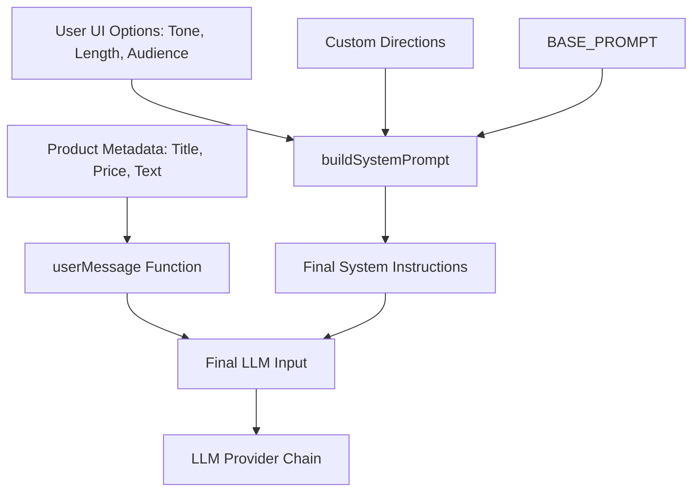
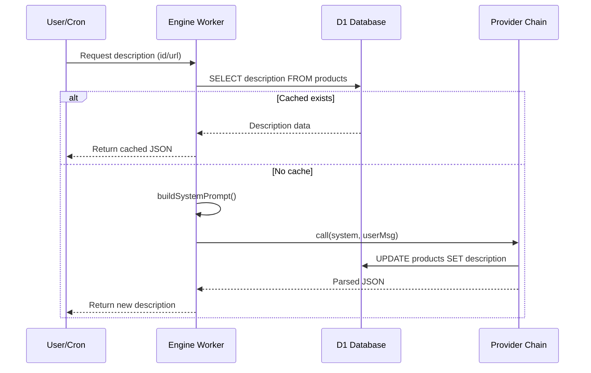

<details>
<summary>Relevant source files</summary>

The following files were used as context for generating this wiki page:

- [shared/prompts.ts](shared/prompts.ts)
- [engine/src/index.ts](engine/src/index.ts)
- [shared/providers.ts](shared/providers.ts)
- [app/public/app.js](app/public/app.js)
- [app/public/index.html](app/public/index.html)
- [infra/schema.sql](infra/schema.sql)
</details>

# LLM Prompts & Instructions

The LLM Prompts & Instructions module is a core component of the Product Describer system, responsible for orchestrating the generation of high-quality, structured product descriptions and justifications. It defines the logical framework for how raw product data (extracted via scrapers) is transformed into user-friendly content using various Large Language Model (LLM) providers like Anthropic, OpenAI, and Gemini.

This system ensures that descriptions are consistent, follow specific stylistic guidelines (tone, length, and audience), and are returned in a strict JSON format for reliable programmatic processing. The instructions are used both in background automated jobs (engine-cron) and on-demand user requests within the web application.

## Prompt Architecture & Construction

The system utilizes a multi-layered prompt construction strategy. A `BASE_PROMPT` defines the identity of the AI and the strict output format, while supplemental instructions are appended based on user configuration or automated requirements.

### System Prompt Components
The `buildSystemPrompt` function assembles the final instructions by combining the following elements:
*  **Base Identity**: Instructs the AI to act as an assistant writing short Swedish product descriptions.
*  **Output Constraint**: Enforces a strict JSON response containing only two keys: `beskrivning` (description) and `varför` (why).
*  **Tone & Style**: Appends specific instructions based on user-selected values (e.g., "saklig", "entusiastisk").
*  **Length Control**: Dictates the number of sentences per field.
*  **Audience Context**: Adapts the justification for specific target groups.

Sources: [shared/prompts.ts:10-21](shared/prompts.ts#L10-L21), [shared/prompts.ts:40-62](shared/prompts.ts#L40-L62)

### User Message Structure
The user message provides the context of the specific product being described. It is formatted as a structured list containing the product title, category, shop name, price, and raw source text (extracted metadata).

Sources: [shared/prompts.ts:64-77](shared/prompts.ts#L64-L77)

The following flowchart illustrates the data flow from user configuration to prompt generation:



The diagram shows how the system prompt is assembled from various configuration inputs while the user message is derived from product metadata. Sources: [shared/prompts.ts](shared/prompts.ts), [engine/src/index.ts:457-463](engine/src/index.ts#L457-L463)

## Stylistic Configurations

The system supports several pre-defined stylistic variations through specific instruction mappings.

### Tone Variations
| Tone | Instruction (Swedish) | Description |
| :--- | :--- | :--- |
| **Saklig** | Håll tonen saklig och informativ. | Factual and informative tone. |
| **Entusiastisk** | Skriv med entusiasm och energi. | Enthusiastic and energetic tone. |
| **Humoristisk** | Lägg in en lätt humoristisk touch. | Light humorous touch. |
| **Lyxig** | Skriv med en exklusiv, premium känsla. | Exclusive, premium feel. |

Sources: [shared/prompts.ts:23-28](shared/prompts.ts#L23-L28)

### Length Constraints
| Level | Instruction (Swedish) | Limit |
| :--- | :--- | :--- |
| **Kort** | Var extra kort — max en mening per fält. | Max 1 sentence. |
| **Medel** | Använd 1–2 meningar per fält (standard). | 1–2 sentences. |
| **Lång** | Du får använda upp till 3 meningar per fält om det behövs. | Up to 3 sentences. |

Sources: [shared/prompts.ts:30-34](shared/prompts.ts#L30-L34)

## Execution Contexts

LLM instructions are executed in two primary environments within the Cloudflare Workers architecture:

### 1. On-Demand Generation
Users can manually trigger a description for a specific product. If a description is already cached in the `products` table, it is returned immediately; otherwise, the `describeProduct` function in the engine worker builds the prompt and calls the LLM.

Sources: [engine/src/index.ts:430-475](engine/src/index.ts#L430-L475), [app/public/app.js:283-320](app/public/app.js#L283-L320)

### 2. Background Automated "Crawl"
The engine's `scheduled` cron handler periodically identifies products missing descriptions and processes them in batches. This process uses the same `buildSystemPrompt` logic but applies the `DEFAULT_VARIATION` to ensure the catalog remains diverse in style.

Sources: [engine/src/index.ts:384-428](engine/src/index.ts#L384-L428), [shared/prompts.ts:36-38](shared/prompts.ts#L36-L38)



This diagram outlines the logic for handling description requests, including the caching mechanism. Sources: [engine/src/index.ts:446-474](engine/src/index.ts#L446-L474), [shared/providers.ts:153-176](shared/providers.ts#L153-L176)

## Response Parsing & Reliability

Because LLMs can occasionally return extra conversational text, the system includes a robust parser that utilizes regular expressions to extract only the valid JSON block from the model's output.

### The Parser Logic
1.  **Regex Matching**: Identifies a block starting with `{` and ending with `}`.
2.  **JSON Validation**: Attempts to `JSON.parse` the matched string.
3.  **Field Mapping**: Normalizes keys (e.g., mapping `varfor` to `varför`).
4.  **Fallback**: If no JSON block is found, the entire raw text is used as the `beskrivning`.

Sources: [shared/providers.ts:128-147](shared/providers.ts#L128-L147)

```typescript
export function parseDescriptionResponse(content: string): { beskrivning: string; varför: string } {
  const text = (content ?? "").trim();
  const match = JSON_BLOCK.exec(text);
  if (match) {
    try {
      const data = JSON.parse(match[0]);
      return {
        beskrivning: String(data.beskrivning ?? "").trim(),
        varför: String(data.varför ?? data.varfor ?? "").trim(),
      };
    } catch { /* fallback to text */ }
  }
  return { beskrivning: text, varför: "" };
}
```

Sources: [shared/providers.ts:131-147](shared/providers.ts#L131-L147)

## Summary
The LLM Prompting system translates abstract product metadata into structured content by combining strict system instructions with flexible user configurations. By centralizing prompt construction in `shared/prompts.ts` and enforcing a reliable parsing strategy in `shared/providers.ts`, the project maintains high content quality across both its automated background engine and its interactive user interface.
