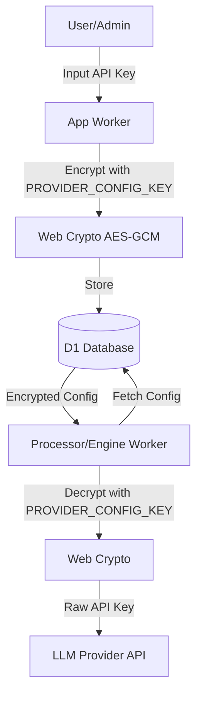
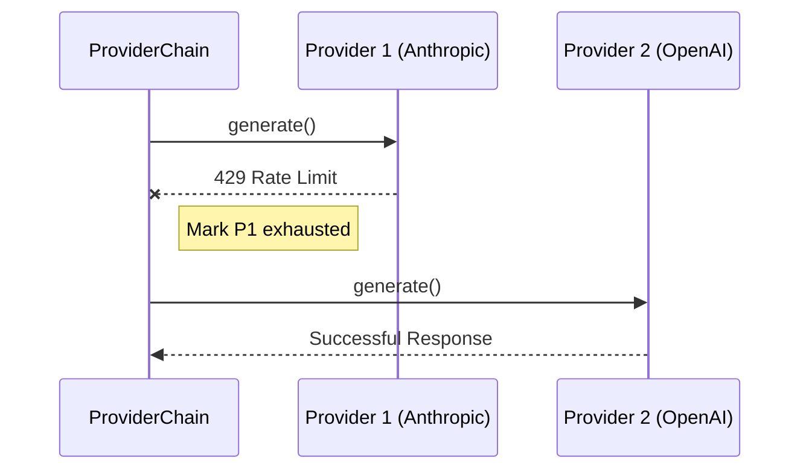

<details>
<summary>Relevant source files</summary>

The following files were used as context for generating this wiki page:

- [shared/provider-config.ts](shared/provider-config.ts)
- [shared/providers.ts](shared/providers.ts)
- [SECURITY.md](SECURITY.md)
- [app/src/index.ts](app/src/index.ts)
- [README.md](README.md)
- [engine/src/index.ts](engine/src/index.ts)
</details>

# Encrypted Provider Configurations

Encrypted Provider Configurations manage the sensitive API credentials required to communicate with various Large Language Model (LLM) providers such as Anthropic, OpenAI, Gemini, and Azure OpenAI. To maintain security, these configurations are stored encrypted within the Cloudflare D1 database, ensuring that raw API keys are never exposed in logs or database dumps.

The system employs a shared encryption key, `PROVIDER_CONFIG_KEY`, which must be synchronized between the application and processor Workers. This architecture allows individual users to provide their own API keys for "on-demand" description generation while the system operator maintains global keys for background catalog tasks.
Sources: [SECURITY.md:14-18](SECURITY.md#L14-L18), [README.md:46-49](README.md#L46-L49), [shared/provider-config.ts:13-16](shared/provider-config.ts#L13-L16)

## Security and Encryption Architecture

The project utilizes the Web Crypto API to implement AES-GCM encryption for all stored provider credentials. This ensures that even if the D1 database is compromised, the API keys remain secure without the master key.

### Encryption Components
*  **Master Key:** A 32-byte random string stored as a Wrangler secret (`PROVIDER_CONFIG_KEY`).
*  **Storage Logic:** Configurations are serialized as JSON, encrypted into a string, and stored in the `provider_configs` table.
*  **Decryption:** Credentials are decrypted just-in-time before making an LLM request via a raw `fetch()` call.

Sources: [SECURITY.md:15-18](SECURITY.md#L15-L18), [shared/provider-config.ts:7-10](shared/provider-config.ts#L7-L10), [README.md:46-49](README.md#L46-L49)



The diagram shows the lifecycle of a provider API key from user input to its secure utilization during an LLM request.
Sources: [shared/provider-config.ts:46-75](shared/provider-config.ts#L46-L75), [app/src/index.ts:251-267](app/src/index.ts#L251-L267)

## Data Structures and Models

Configurations are categorized by provider name and associated with specific account IDs.

### Supported Providers and Models
| Provider | Default Model | Extra Fields Required |
| :--- | :--- | :--- |
| `anthropic` | `claude-sonnet-4-6` | None |
| `openai` | `gpt-4.1-mini` | None |
| `gemini` | `gemini-2.5-flash` | None |
| `azure_openai` | (Specified by deployment) | `endpoint`, `deployment` |

Sources: [shared/provider-config.ts:21-35](shared/provider-config.ts#L21-L35), [shared/providers.ts:42-47](shared/providers.ts#L42-L47)

### Database Schema (Logical)
| Table | Field | Type | Description |
| :--- | :--- | :--- | :--- |
| `provider_configs` | `account_id` | TEXT | Link to the user account |
| `provider_configs` | `provider` | TEXT | Name of the LLM provider |
| `provider_configs` | `encrypted_config` | TEXT | AES-GCM encrypted JSON blob |
| `provider_order` | `order_json` | TEXT | Prioritized list of providers for failover |

Sources: [shared/provider-config.ts:46-51](shared/provider-config.ts#L46-L51), [shared/provider-config.ts:104-106](shared/provider-config.ts#L104-L106)

## Provider Selection and Failover

The system uses a "Provider Chain" logic to ensure reliability. If a provider returns a rate limit or billing error, the system automatically attempts the next configured provider in the user's prioritized list.

### ProviderChain Logic
1.  **Prioritization:** The system retrieves the user's preferred order from the `provider_order` table.
2.  **Availability Check:** It filters for providers that have valid, ready configurations (e.g., presence of `api_key`).
3.  **Execution:** It attempts the call with the first provider.
4.  **Error Handling:** If a `RateLimitExceeded` error occurs, that provider is marked as "exhausted" for a specific duration, and the system tries the next provider.

Sources: [shared/providers.ts:145-188](shared/providers.ts#L145-L188), [shared/provider-config.ts:117-133](shared/provider-config.ts#L117-L133)



The sequence diagram illustrates the failover mechanism when a primary provider is exhausted.
Sources: [shared/providers.ts:162-180](shared/providers.ts#L162-L180)

## Configuration Endpoints

The Application Worker provides several API endpoints for managing these configurations, restricted primarily to administrative roles or the account owner.

### API Endpoint Summary
| Method | Endpoint | Description |
| :--- | :--- | :--- |
| `GET` | `/api/settings` | Retrieves current configuration status and labels. |
| `POST` | `/api/settings/key` | Encrypts and saves a new API key and its extra fields. |
| `DELETE` | `/api/settings/key/:provider` | Removes a specific provider configuration. |
| `POST` | `/api/settings/order` | Sets the priority order for provider failover. |

Sources: [app/src/index.ts:119-125](app/src/index.ts#L119-L125), [app/src/index.ts:316-363](app/src/index.ts#L316-L363)

## Key Implementation Details

### Configuration Validation
Before a provider is considered "ready" for the chain, it must pass a validation check ensuring all required fields for that specific provider are present.

```typescript
// shared/provider-config.ts
export function isProviderReady(provider: ProviderName, config: ProviderConfig): boolean {
  if (!config.api_key) return false;
  return (EXTRA_FIELDS[provider] ?? []).every((field) => config[field.name]);
}
```

Sources: [shared/provider-config.ts:88-91](shared/provider-config.ts#L88-L91)

### Error Identification
The system parses error responses from LLM providers to distinguish between transient rate limits and terminal billing issues, using phrases like "insufficient_quota" or "exceeded your current quota".
Sources: [shared/providers.ts:24-34](shared/providers.ts#L24-L34)

## Summary
The Encrypted Provider Configuration system provides a secure, flexible foundation for LLM interactions. By leveraging Cloudflare's Web Crypto and D1 storage, it balances the need for high-security credential management with a robust failover architecture that maximizes service availability across multiple AI providers.
Sources: [README.md:46-52](README.md#L46-L52), [shared/provider-config.ts:1-10](shared/provider-config.ts#L1-L10)
