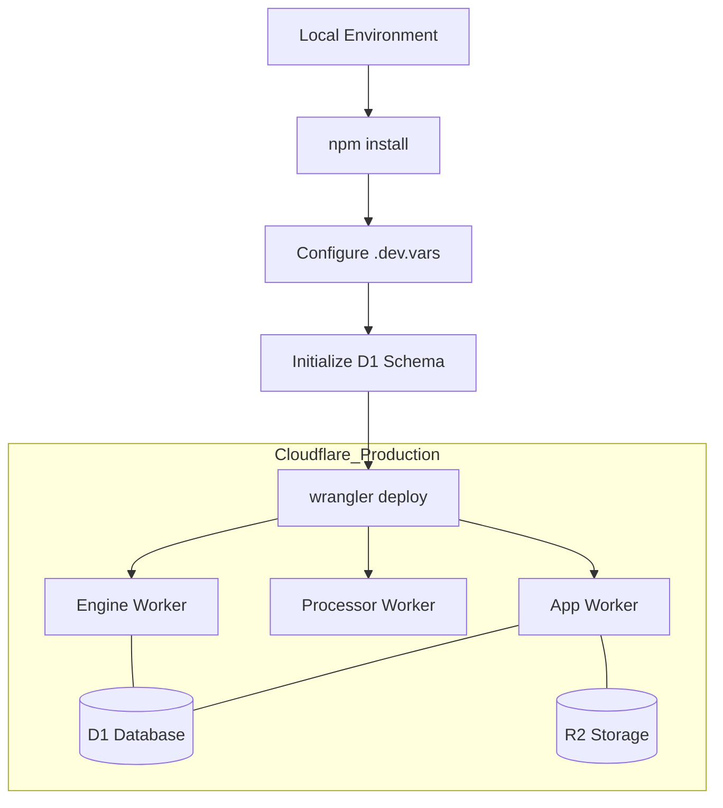
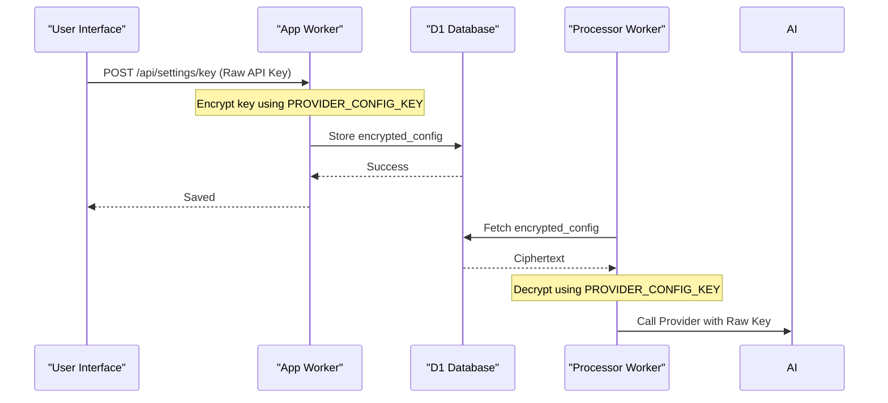

<details>
<summary>Relevant source files</summary>

The following files were used as context for generating this wiki page:

- [README.md](README.md)
- [SECURITY.md](SECURITY.md)
- [DESIGN.md](DESIGN.md)
- [engine/package.json](engine/package.json)
- [processor/package.json](processor/package.json)
- [app/package.json](app/package.json)
- [engine/src/index.ts](engine/src/index.ts)
- [infra/schema.sql](infra/schema.sql)
</details>

# Deployment & Secrets Management

The Deployment & Secrets Management system for the product-describer-cloudflare project is built on the Cloudflare Workers ecosystem. It leverages `wrangler` for deployment orchestration across multiple micro-services (Workers), including the frontend application, the product processor, and the catalog engine. The architecture emphasizes a "brain and memory" model where Cloudflare handles durable data and logic, while external resources serve as "muscles."

Security is maintained through a combination of Wrangler secrets for infrastructure-level credentials and encrypted database storage for user-provided AI provider keys. This ensures that sensitive tokens for Anthropic, OpenAI, and Gemini are never exposed in logs or version control.

Sources: [README.md:1-15](README.md#L1-L15), [DESIGN.md:20-35](DESIGN.md#L20-L35), [SECURITY.md:13-18](SECURITY.md#L13-L18)

## Deployment Architecture

The project is composed of several independent Workers, each with its own deployment lifecycle managed via `wrangler deploy`. The deployment process involves provisioning Cloudflare D1 databases, R2 buckets, and KV namespaces.

### Core Components
| Component | Directory | Purpose |
| :--- | :--- | :--- |
| **App** | `app/` | Web UI and API for authentication, file uploads, and job management. |
| **Processor** | `processor/` | Queue consumer that handles extraction and AI description generation. |
| **Engine** | `engine/` | Catalog engine that drives crawling, scheduling, and price monitoring. |
| **Token Rotator** | `token-rotator/` | Automates the extension of Cloudflare API tokens. |

Sources: [README.md:18-38](README.md#L18-L38), [app/package.json](app/package.json), [processor/package.json](processor/package.json), [engine/package.json](engine/package.json)

### Workflow and Provisioning
The following diagram illustrates the deployment flow from local development to the Cloudflare production environment:



Sources: [README.md:65-95](README.md#L65-L95), [DESIGN.md:45-55](DESIGN.md#L45-L55)

## Secrets Management

Secrets are divided into two categories: deployment-time secrets managed via Wrangler and runtime application secrets stored in the database.

### Wrangler Secrets
Infrastructure-level secrets are injected into the Worker environment using `npx wrangler secret put [KEY]`. These are used for API keys that belong to the system operator.

*  **`PROVIDER_CONFIG_KEY`**: A symmetric encryption key (AES-GCM) used by the `app` Worker to encrypt AI provider credentials and by the `processor` Worker to decrypt them.
*  **`INGEST_API_KEY`**: An operator-level key used to authenticate the external Playwright fetcher against the `engine` endpoints.
*  **`GITHUB_ERROR_REPORT_TOKEN`**: Used for automatic error reporting to GitHub issues.
*  **AI Provider Keys**: `GEMINI_API_KEY`, `ANTHROPIC_API_KEY`, and `OPENAI_API_KEY` used by the `engine` for background catalog enrichment.

Sources: [README.md:88-105](README.md#L88-L105), [SECURITY.md:13-18](SECURITY.md#L13-L18), [engine/src/index.ts:25-45](engine/src/index.ts#L25-L45)

### Encrypted Database Storage
User-specific AI provider credentials are not stored as environment variables. Instead, they are stored in the `provider_configs` table within Cloudflare D1.

```sql
CREATE TABLE provider_configs (
  account_id TEXT NOT NULL REFERENCES accounts(id),
  provider TEXT NOT NULL,
  encrypted_config TEXT NOT NULL,
  PRIMARY KEY (account_id, provider)
);
```

Sources: [infra/schema.sql:27-32](infra/schema.sql#L27-L32), [SECURITY.md:16-17](SECURITY.md#L16-L17)

### Encryption Flow
The following sequence diagram shows how the `PROVIDER_CONFIG_KEY` is used to secure provider credentials:



Sources: [README.md:73-80](README.md#L73-L80), [SECURITY.md:15-18](SECURITY.md#L15-L18), [infra/schema.sql:27-32](infra/schema.sql#L27-L32)

## Deployment Commands

The project utilizes standard `npm` scripts to wrap `wrangler` commands for consistent deployment.

| Script | Command | Context |
| :--- | :--- | :--- |
| `dev` | `wrangler dev --remote` | Starts local development connected to remote resources. |
| `deploy` | `wrangler deploy` | Deploys the specific Worker to Cloudflare. |
| `secret:set-provider-key` | `wrangler secret put PROVIDER_CONFIG_KEY` | Sets the shared encryption key. |
| `secret:set-ingest-key` | `wrangler secret put INGEST_API_KEY` | Sets the engine's ingestion authentication key. |

Sources: [engine/package.json:6-9](engine/package.json#L6-L9), [processor/package.json:6-9](processor/package.json#L6-L9), [app/package.json:6-9](app/package.json#L6-L9)

## Security Best Practices for Deployment

1.  **Credential Isolation**: Never commit keys or tokens to version control. Use `.dev.vars` for local development and Wrangler secrets for production.
2.  **Shared Secrets**: Ensure `PROVIDER_CONFIG_KEY` matches exactly between `app/` and `processor/` to allow successful decryption of job data.
3.  **Audit Logs**: Review automated dependency and security alerts before every deployment.
4.  **Least Privilege**: `INGEST_API_KEY` is used exclusively for the stateless fetcher; it should not be shared with standard users.

Sources: [SECURITY.md:13-18](SECURITY.md#L13-L18), [README.md:78-80](README.md#L78-L80)

The Deployment & Secrets Management strategy ensures the project remains scalable and secure by offloading sensitive storage to Cloudflare's managed services and enforcing strict encryption for all third-party AI credentials.
