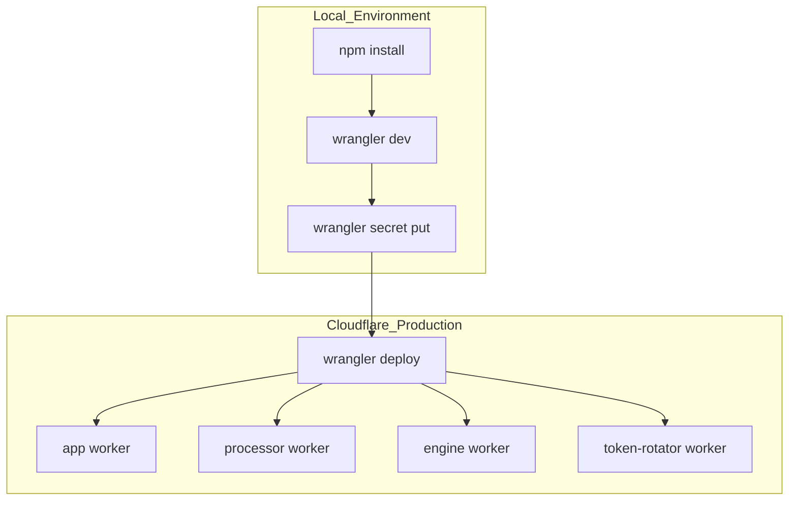
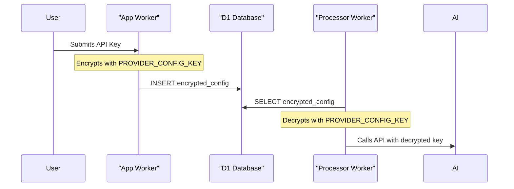

<details>
<summary>Relevant source files</summary>

The following files were used as context for generating this wiki page:

- [README.md](README.md)
- [SECURITY.md](SECURITY.md)
- [DESIGN.md](DESIGN.md)
- [processor/package.json](processor/package.json)
- [engine/package.json](engine/package.json)
- [app/package.json](app/package.json)
- [token-rotator/package.json](token-rotator/package.json)
- [engine/src/index.ts](engine/src/index.ts)
- [infra/schema.sql](infra/schema.sql)
</details>

# Deployment & Secrets Management

The Product Describer project utilizes a distributed architecture based on Cloudflare Workers, D1 databases, and R2 storage. The deployment strategy focuses on a "brain and memory" model where Cloudflare handles logic and persistence, while external stateless "muscles" (fetchers) handle resource-intensive tasks like web rendering. Secrets management is strictly enforced through Cloudflare Wrangler secrets and environment variables to ensure that sensitive API keys and encryption tokens are never committed to the repository.

Sources: [DESIGN.md:20-25](DESIGN.md#L20-L25), [README.md:1-15](README.md#L1-L15), [SECURITY.md:15-20](SECURITY.md#L15-L20)

## Deployment Architecture

The system is split into multiple specialized Workers, each requiring individual deployment and configuration. The primary components include the `app` (UI/API), `processor` (queue consumer), `engine` (catalog/cron driver), and `token-rotator` (automated maintenance).

### Deployment Workflow
Deployment is managed via the `wrangler` CLI. Each worker directory contains a `package.json` with scripts for local development and production deployment.



The diagram shows the standard flow from local setup to production deployment across multiple Cloudflare Workers.
Sources: [app/package.json:6-9](app/package.json#L6-L9), [processor/package.json:6-9](processor/package.json#L6-L9), [engine/package.json:6-9](engine/package.json#L6-L9), [README.md:95-105](README.md#L95-L105)

### Component-Specific Scripts
| Worker | Deployment Script | Secret Management Script |
| :--- | :--- | :--- |
| **App** | `wrangler deploy` | `wrangler secret put PROVIDER_CONFIG_KEY` |
| **Processor** | `wrangler deploy` | `wrangler secret put PROVIDER_CONFIG_KEY` |
| **Engine** | `wrangler deploy` | `wrangler secret put INGEST_API_KEY` |
| **Token Rotator** | `wrangler deploy` | `wrangler secret put CF_ADMIN_TOKEN` |

Sources: [app/package.json:8-10](app/package.json#L8-L10), [processor/package.json:8-10](processor/package.json#L8-L10), [engine/package.json:8-10](engine/package.json#L8-L10), [token-rotator/package.json:6-8](token-rotator/package.json#L6-L8)

## Secrets & Security Management

The project implements a zero-trust approach for credentials. Raw provider credentials (API keys) are never logged, echoed, or committed.

### Key Secrets
1.  **PROVIDER_CONFIG_KEY**: A symmetric encryption key (AES-GCM) that MUST be identical between the `app` and `processor` workers. The `app` worker uses it to encrypt user-provided API keys in the D1 database, and the `processor` uses it to decrypt them during job execution.
2.  **INGEST_API_KEY**: An operator-level key used to authorize communication between the external Playwright fetcher and the `engine` worker.
3.  **LLM API Keys**: Provider-specific secrets (Anthropic, OpenAI, Gemini, Azure) stored directly in the Worker environment for the `engine` worker's background tasks.

Sources: [SECURITY.md:15-22](SECURITY.md#L15-L22), [README.md:79-85](README.md#L79-L85), [engine/src/index.ts:35-50](engine/src/index.ts#L35-L50)

### Encryption Flow
User credentials for AI providers are stored encrypted in the `provider_configs` table.



This diagram illustrates how the `PROVIDER_CONFIG_KEY` acts as a shared secret between workers to protect user credentials at rest.
Sources: [infra/schema.sql:32-38](infra/schema.sql#L32-L38), [README.md:83-87](README.md#L83-L87), [SECURITY.md:19-21](SECURITY.md#L19-L21)

## Environment Configuration

Deployment requires provisioning Cloudflare resources and updating `wrangler.jsonc` files (currently using `"TBD"` placeholders for production IDs).

### Configuration Options (Engine Worker)
| Variable | Type | Default | Description |
| :--- | :--- | :--- | :--- |
| `SCHEDULE_LIMIT` | string | 200 | Max detail jobs created per cron tick |
| `DESCRIBE_LIMIT` | string | 10 | Max products to describe per cron tick |
| `DESCRIBE_WORKERS` | string | 2 | Parallel AI calls allowed per tick |
| `ALERT_MIN_DROP_PCT`| string | 5 | Minimum price drop % to trigger alert |
| `ALERT_MIN_DROP_KR` | string | 100 | Minimum price drop in SEK to trigger alert |

Sources: [engine/src/index.ts:51-60](engine/src/index.ts#L51-L60)

## Local Development vs. Production

The project provides specialized local testing procedures due to Wrangler limitations regarding shared state between separate worker processes.

### Local Setup Steps

```bash
# 1. Generate the shared encryption key
openssl rand -base64 32

# 2. Initialize the local D1 database
cd app && npx wrangler d1 execute product_describer --local --file=../infra/schema.sql

# 3. Start combined local environment (shared state)
npx wrangler dev --local --persist-to /tmp/pd-state -c wrangler.jsonc -c ../processor/wrangler.jsonc
```

Sources: [README.md:75-93](README.md#L75-L93)

## Summary
Deployment and secrets management in the Product Describer project are tightly coupled with the Cloudflare ecosystem. By utilizing Wrangler secrets for keys like `PROVIDER_CONFIG_KEY` and `INGEST_API_KEY`, the system ensures secure inter-worker communication and protected storage of sensitive user credentials in D1. The multi-worker deployment model allows for granular scaling and separation of concerns between the user interface, background processing, and catalog maintenance.
