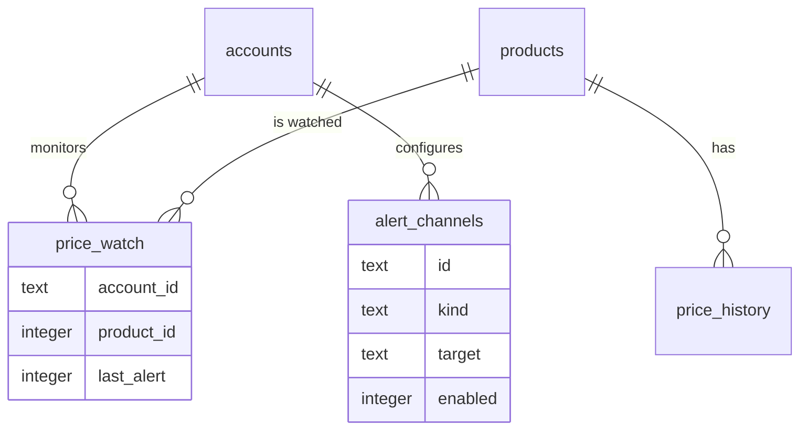
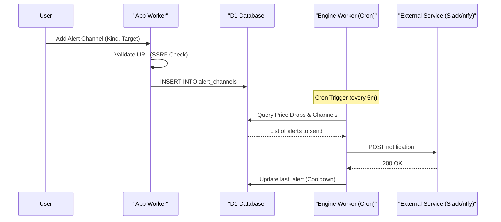

<details>
<summary>Relevant source files</summary>

The following files were used as context for generating this wiki page:

- [app/src/watch.ts](app/src/watch.ts)
- [PROPOSAL-hopslagen-app.md](PROPOSAL-hopslagen-app.md)
- [infra/schema.sql](infra/schema.sql)
- [engine/src/index.ts](engine/src/index.ts)
- [app/public/index.html](app/public/index.html)
- [app/public/app.js](app/public/app.js)
</details>

# Extending Alert Channels

Extending Alert Channels refers to the modular system within the Product Describer project that allows users to receive notifications when specific price drop criteria are met. The system is designed to be extensible, supporting multiple communication protocols through a unified interface. These alerts are triggered by a background cron job that monitors the product catalog for price changes relative to historical data.

The alert infrastructure is primarily housed in the `engine` worker, which handles the logic for detecting price drops and dispatching messages, while the `app` worker provides the user interface for managing these channels. The project currently supports several modular channels including email, ntfy, Slack, Telegram, and generic webhooks.

Sources: [PROPOSAL-hopslagen-app.md:46-51](PROPOSAL-hopslagen-app.md#L46-L51), [engine/src/index.ts:13-20](engine/src/index.ts#L13-L20)

## Architecture and Data Flow

The alert system operates as a step within the unified `engine` cron trigger, which executes every five minutes. The process involves identifying watched products with recent price drops, validating them against configured thresholds, and iterating through the user's enabled alert channels to send notifications.

### Alert Detection Logic
The system identifies a "price drop" based on two primary thresholds:
1.  **Percentage Drop**: The price must fall by at least a specific percentage (default: 5%).
2.  **Absolute Value**: The price must fall by at least a minimum currency amount (default: 100 kr).

Additionally, an `alert_cooldown` mechanism prevents spamming users with the same alert repeatedly. The default cooldown period is 24 hours.

Sources: [PROPOSAL-hopslagen-app.md:48-50](PROPOSAL-hopslagen-app.md#L48-L50), [engine/src/index.ts:515-517](engine/src/index.ts#L515-L517)

### Data Relationship Diagram
The following diagram illustrates how user accounts, watched products, and alert channels are related in the D1 database.



Sources: [infra/schema.sql:119-145](infra/schema.sql#L119-L145)

## Supported Alert Channels

Alert channels are modular; each channel type is defined by a `kind` and a `target` configuration. The project explicitly supports the following:

| Channel Kind | Description | Target Format |
| :--- | :--- | :--- |
| **Email** | Standard email notifications. | Email address |
| **ntfy** | Simple HTTP-based pub-sub notifications. | Topic URL (e.g., https://ntfy.sh/topic) |
| **Slack** | Integration via Incoming Webhooks. | Slack Webhook URL |
| **Telegram** | Notifications via Telegram Bot API. | `bottoken:chatid` |
| **Webhook** | Generic JSON POST requests. | Destination URL |

Sources: [PROPOSAL-hopslagen-app.md:50-51](PROPOSAL-hopslagen-app.md#L50-L51), [app/public/index.html:150-155](app/public/index.html#L150-L155), [engine/src/index.ts:468-498](engine/src/index.ts#L468-L498)

### Implementation Detail: Dispatching Alerts
The `sendAlert` function in the engine handles the HTTP requests for various channel types. Most channels utilize a standard POST request with varying headers or body structures.

```typescript
async function sendAlert(kind: string, target: string, title: string, body: string, url: string): Promise<boolean> {
  try {
    if (kind === "ntfy") {
      const r = await fetch(target, { method: "POST", headers: { Title: title, Click: url }, body });
      return r.ok;
    }
    if (kind === "slack") {
      const r = await fetch(target, {
        method: "POST",
        headers: { "content-type": "application/json" },
        body: JSON.stringify({ text: `*${title}*\n${body}\n${url}` }),
      });
      return r.ok;
    }
    // ... telegram and generic webhook implementations follow similar patterns
  } catch {
    return false;
  }
}
```

Sources: [engine/src/index.ts:468-498](engine/src/index.ts#L468-L498)

## Security and Validation

To prevent Server-Side Request Forgery (SSRF) and ensure channel stability, the system implements specific validation checks for alert targets, especially those involving URLs.

### SSRF Protection
For channels that accept URLs (`ntfy`, `slack`, `webhook`), the `app` worker performs a "Safe Webhook" check. This validation ensures:
*  The protocol is strictly `https:`.
*  The hostname is not `localhost`, `.internal`, or `.local`.
*  The IP address is not part of a private or internal range (e.g., RFC1918, CGNAT, or cloud metadata services like `169.254.169.254`).

Sources: [app/src/watch.ts:54-80](app/src/watch.ts#L54-L80)

### Sequence of Alert Management
The following sequence diagram shows the flow from a user adding a channel to the system dispatching an alert.



Sources: [app/src/watch.ts:103-112](app/src/watch.ts#L103-L112), [engine/src/index.ts:602-615](engine/src/index.ts#L602-L615), [app/public/app.js:626-641](app/public/app.js#L626-L641)

## Configuration and Schema

The system relies on several tables within the D1 database to track user preferences and alert history.

### alert_channels Table
| Field | Type | Description |
| :--- | :--- | :--- |
| `id` | TEXT | Primary key (Random ID). |
| `account_id` | TEXT | Reference to the user account. |
| `kind` | TEXT | The type of channel (ntfy, slack, etc). |
| `target` | TEXT | Configuration (URL or token string). |
| `enabled` | INTEGER | Toggle (1 for ON, 0 for OFF). |

Sources: [infra/schema.sql:136-145](infra/schema.sql#L136-L145)

### price_watch Table
This table tracks which products a user is following and when the last alert was sent.
| Field | Type | Description |
| :--- | :--- | :--- |
| `account_id` | TEXT | Reference to the user account. |
| `product_id` | INTEGER | Reference to the product in the catalog. |
| `last_alert` | INTEGER | Unix timestamp of the last dispatched alert. |

Sources: [infra/schema.sql:126-132](infra/schema.sql#L126-L132)

## Summary
The alert channel system provides a modular and secure way for users to track price movements. By centralizing logic in the `engine` worker's cron job and enforcing strict URL validation in the `app` worker, the project maintains a decoupled architecture that is easy to extend with new notification services (such as Discord or SMS) in the future, should requirements change.

Sources: [PROPOSAL-hopslagen-app.md:46-51](PROPOSAL-hopslagen-app.md#L46-L51), [DESIGN.md:200-210](DESIGN.md#L200-L210)
