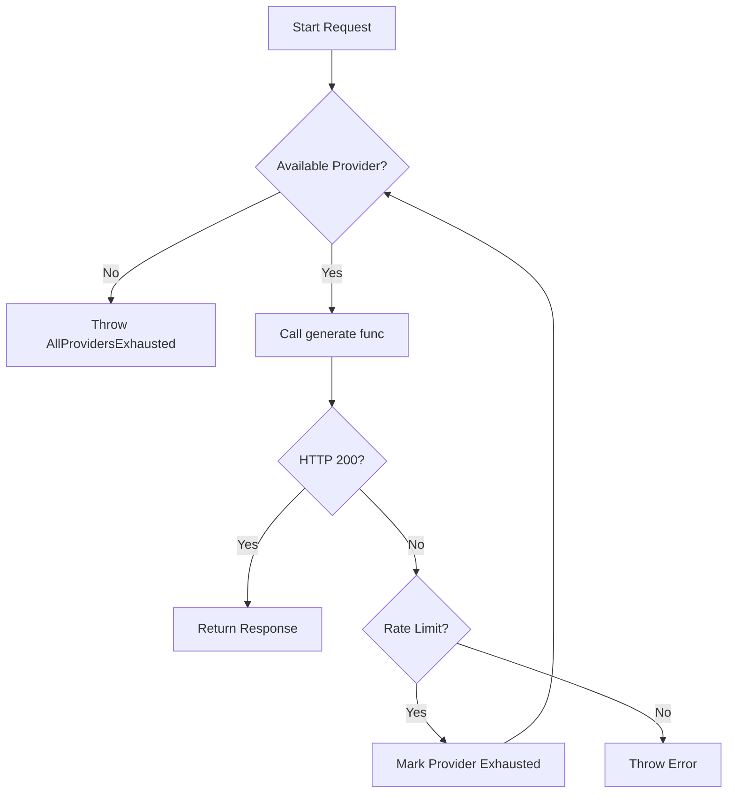
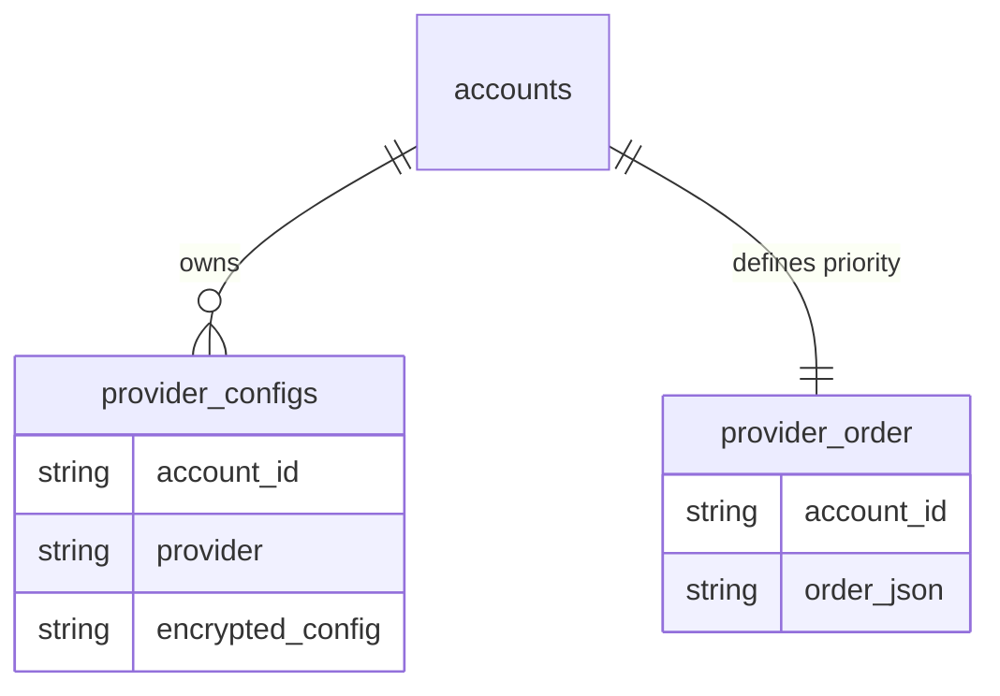

<details>
<summary>Relevant source files</summary>

The following files were used as context for generating this wiki page:

- [shared/providers.ts](shared/providers.ts)
- [engine/src/index.ts](engine/src/index.ts)
- [app/public/app.js](app/public/app.js)
- [infra/schema.sql](infra/schema.sql)
- [SECURITY.md](SECURITY.md)
- [README.md](README.md)
</details>

# Adding New AI Providers

Adding a new AI provider to the Product Describer platform involves updating the core shared provider logic, modifying the database schema for configuration storage, and updating the frontend management interface. The system is designed to use raw `fetch()` calls rather than official SDKs because standard AI SDKs are not compatible with the Cloudflare Workers runtime.

The system currently supports Anthropic, OpenAI, Gemini, and Azure OpenAI. Adding a new provider requires implementing its specific API request/response format within the `shared/providers.ts` logic and ensuring its configuration fields are handled in both the `app` and `engine` workers.

Sources: [shared/providers.ts:1-10](shared/providers.ts#L1-L10), [README.md:9-12](README.md#L9-L12)

## Architecture and Data Flow

The project utilizes a centralized `ProviderChain` to manage multiple AI providers. This chain provides automated failover: if one provider reaches a rate limit or quota, the system automatically attempts the next available provider in the chain.

### Provider Execution Flow
The following diagram illustrates how the `ProviderChain` handles requests and manages provider exhaustion.



The `ProviderChain` maintains a map of exhausted providers and their expected reset times based on `Retry-After` headers or default intervals.
Sources: [shared/providers.ts:153-186](shared/providers.ts#L153-L186), [engine/src/index.ts:327-335](engine/src/index.ts#L327-L335)

## Backend Implementation

To add a new provider, developers must modify the `shared/providers.ts` file to include the new provider's API specifications and request logic.

### 1. Define Provider Types and Models
Update the `ProviderName` type and the `DEFAULT_MODELS` mapping to include the new service and its recommended models.

| Component | Description |
| :--- | :--- |
| `ProviderName` | A union type of valid provider strings. |
| `DEFAULT_MODELS` | A record mapping provider names to arrays of supported model strings. |
| `ProviderCreds` | An interface defining the necessary authentication fields (e.g., `apiKey`, `endpoint`). |

Sources: [shared/providers.ts:38-51](shared/providers.ts#L38-L51)

### 2. Implement Generation Logic
A specific `generate[Provider]` function must be created. This function handles the construction of the HTTP request, including headers and the specific JSON body structure required by the provider's REST API.

```typescript
// Example of the generate function structure in shared/providers.ts
async function generateNewProvider(creds: ProviderCreds, systemPrompt: string, userMessage: string, model: string): Promise<string> {
  const resp = await fetch("https://api.newprovider.com/v1/chat", {
    method: "POST",
    headers: {
      "Authorization": `Bearer ${creds.apiKey}`,
      "Content-Type": "application/json",
    },
    body: JSON.stringify({
      model,
      messages: [
        { role: "system", content: systemPrompt },
        { role: "user", content: userMessage }
      ],
    }),
  });
  if (!resp.ok) await handleProviderError("new_provider", resp);
  const data = await resp.json();
  return data.choices[0].text;
}
```

Sources: [shared/providers.ts:58-112](shared/providers.ts#L58-L112)

### 3. Error Handling
The `handleProviderError` function must be updated to recognize provider-specific error messages. This is critical for the `ProviderChain` to identify billing exhaustion versus transient rate limits. The system searches for phrases such as "insufficient_quota" or "credit balance" to trigger a long-term (6 hour) retry delay.
Sources: [shared/providers.ts:19-30](shared/providers.ts#L19-L30), [shared/providers.ts:124-133](shared/providers.ts#L124-L133)

## Database Configuration

AI provider settings are stored in the D1 database. Adding a provider with unique configuration requirements (like Azure OpenAI's deployment name) requires handling these in the `provider_configs` table.

### Schema Relationships
The following ER diagram shows how provider configurations are tied to user accounts and the generation process.



Configurations are stored as AES-GCM encrypted JSON blobs in the `encrypted_config` field to ensure security.
Sources: [infra/schema.sql:26-38](infra/schema.sql#L26-L38), [SECURITY.md:15-18](SECURITY.md#L15-L18)

## Frontend Management

The administrative and user settings interfaces in the `app` worker must be updated to support the new provider's inputs.

### UI Configuration in `app.js`
The `PROVIDER_NAMES` array in the frontend must be updated to include the new provider. The UI dynamically renders "Extra Fields" for providers that require more than just an API key.

```javascript
// app/public/app.js:84
const PROVIDER_NAMES = ["anthropic", "openai", "gemini", "azure_openai", "new_provider"];

// Logic for rendering provider-specific fields
function renderExtraFields(data) {
  const provider = document.getElementById("provider-select").value;
  const div = document.getElementById("extra-fields");
  div.innerHTML = "";
  for (const field of data.extra_fields[provider] ?? []) {
    const input = document.createElement("input");
    // ... input creation logic ...
  }
}
```

Sources: [app/public/app.js:84-135](app/public/app.js#L84-L135), [app/public/index.html:61-71](app/public/index.html#L61-L71)

## Security Requirements

When adding a new provider, strictly adhere to the project's security policy:
1. **No Credentials in Code:** Never commit API keys or tokens. Use Wrangler secrets or environment variables.
2. **Encryption:** All provider configurations must be encrypted before storage in D1 using the `PROVIDER_CONFIG_KEY`.
3. **Secret Storage:** Provider-level API keys used by the `engine` worker (for catalog enrichment) must be stored as secrets (e.g., `ANTHROPIC_API_KEY`).

Sources: [SECURITY.md:12-19](SECURITY.md#L12-L19), [engine/src/index.ts:25-30](engine/src/index.ts#L25-L30)

## Summary

Successfully adding a new AI provider enables the system to utilize diverse LLMs for product description generation while maintaining high availability through the `ProviderChain` failover mechanism. The process ensures that new integration logic remains encapsulated within the `shared` module, facilitating consistent behavior across the `app`, `processor`, and `engine` workers.
