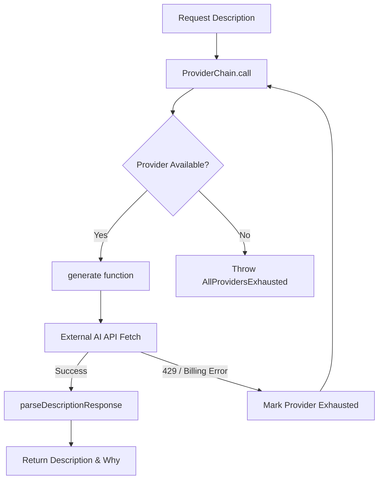
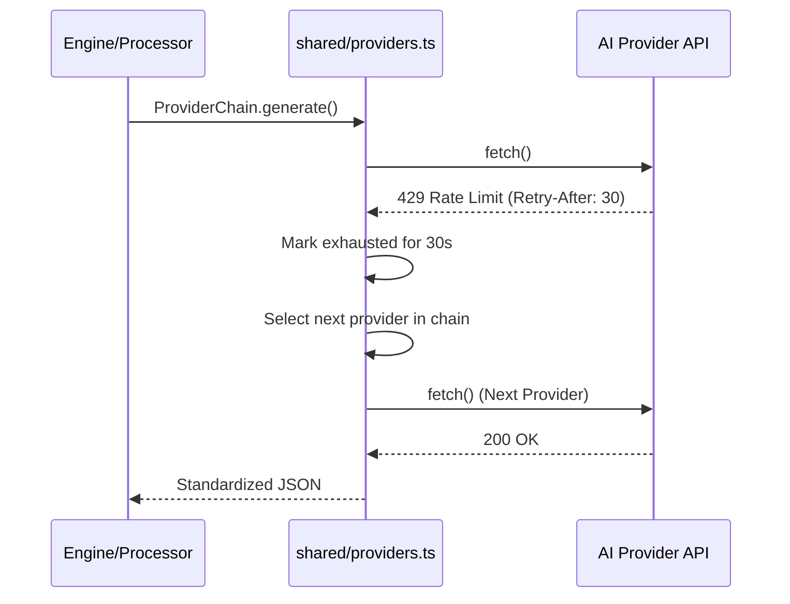

<details>
<summary>Relevant source files</summary>

The following files were used as context for generating this wiki page:

- [shared/providers.ts](shared/providers.ts)
- [engine/src/index.ts](engine/src/index.ts)
- [app/public/app.js](app/public/app.js)
- [infra/schema.sql](infra/schema.sql)
- [README.md](README.md)
</details>

# Adding New AI Providers

Adding a new AI provider to the Product Describer system involves updating the shared provider logic, the database schema, and the frontend configuration. The system is designed to use raw `fetch()` calls against REST APIs because standard AI SDKs are often incompatible with the Cloudflare Workers runtime.

Sources: [shared/providers.ts:1-7](shared/providers.ts#L1-L7), [README.md:10-12](README.md#L10-L12)

## Provider Architecture

The project utilizes a centralized provider management system located in `shared/providers.ts`. This module defines how the system interacts with different Large Language Model (LLM) APIs, handles rate limiting, and parses responses into a standardized format.

### Core Components

*  **ProviderChain Class**: Manages a list of prioritized providers. It attempts to call providers in order and automatically skips those currently exhausted due to rate limits or billing issues. Sources: [shared/providers.ts:161-196](shared/providers.ts#L161-L196)
*  **Generate Function**: A switch-based dispatcher that routes requests to provider-specific implementation functions (e.g., `generateAnthropic`, `generateGemini`). Sources: [shared/providers.ts:62-79](shared/providers.ts#L62-L79)
*  **Error Handling**: The system detects `429 Rate Limit` errors and billing exhaustion by matching specific strings in API responses (e.g., "insufficient_quota"). Sources: [shared/providers.ts:13-33](shared/providers.ts#L13-L33)

### Provider Data Flow

The following diagram illustrates how a request for a product description flows through the provider chain logic.



This diagram shows the retry and failover logic within the `ProviderChain`.
Sources: [shared/providers.ts:161-210](shared/providers.ts#L161-L210)

## Implementation Steps

### 1. Update Shared Provider Logic
To add a new provider, you must define its name in the `ProviderName` type and add its default models to the `DEFAULT_MODELS` record.

```typescript
export type ProviderName = "anthropic" | "openai" | "gemini" | "azure_openai" | "new_provider";

export const DEFAULT_MODELS: Record<ProviderName, string[]> = {
  // ... existing providers
  new_provider: ["model-v1", "model-v2"],
};
```

Sources: [shared/providers.ts:47-55](shared/providers.ts#L47-L55)

A specific implementation function must be created that performs the `fetch()` call to the provider's REST endpoint. This function must handle the specific request/response JSON structure required by that provider. Sources: [shared/providers.ts:81-125](shared/providers.ts#L81-L125)

### 2. Database Schema Configuration
Providers are stored in the `provider_configs` table. This table uses an AES-GCM encrypted JSON blob to store credentials.

| Field | Type | Description |
| :--- | :--- | :--- |
| `account_id` | TEXT | Reference to the user account |
| `provider` | TEXT | The unique name of the AI provider |
| `encrypted_config` | TEXT | Encrypted JSON containing `api_key` and other fields |

Sources: [infra/schema.sql:32-37](infra/schema.sql#L32-L37)

### 3. Frontend Integration
The frontend must be updated in `app/public/app.js` to include the new provider in the configuration UI. This includes adding the provider to the `PROVIDER_NAMES` array and updating the label mappings.

```javascript
const PROVIDER_NAMES = ["anthropic", "openai", "gemini", "azure_openai", "new_provider"];
```

Sources: [app/public/app.js:84-135](app/public/app.js#L84-L135)

## Rate Limit and Billing Management

The system maintains an `exhaustedUntil` map to track when a provider can be used again. If a provider returns a rate limit error, the system calculates a reset time based on the `Retry-After` header or a default 6-hour window for billing issues.



This sequence shows the failover mechanism when an API limit is reached.
Sources: [shared/providers.ts:133-146](shared/providers.ts#L133-L146), [shared/providers.ts:178-193](shared/providers.ts#L178-L193)

## Summary of Configuration Requirements

| Provider | Required Credentials | API Version / Versioning |
| :--- | :--- | :--- |
| **Anthropic** | `apiKey` | `2023-06-01` |
| **Azure OpenAI** | `apiKey`, `endpoint`, `deployment` | `2024-10-21` |
| **OpenAI** | `apiKey` | Chat Completions v1 |
| **Gemini** | `apiKey` | v1beta |

Sources: [shared/providers.ts:10-11](shared/providers.ts#L10-L11), [shared/providers.ts:57-60](shared/providers.ts#L57-L60), [shared/providers.ts:114-115](shared/providers.ts#L114-L115)

By following this architecture, new AI providers can be integrated into both the `processor` (for bulk file processing) and the `engine` (for automated catalog descriptions) workers seamlessly. Sources: [README.md:20-30](README.md#L20-L30), [engine/src/index.ts:316-335](engine/src/index.ts#L316-L335)
