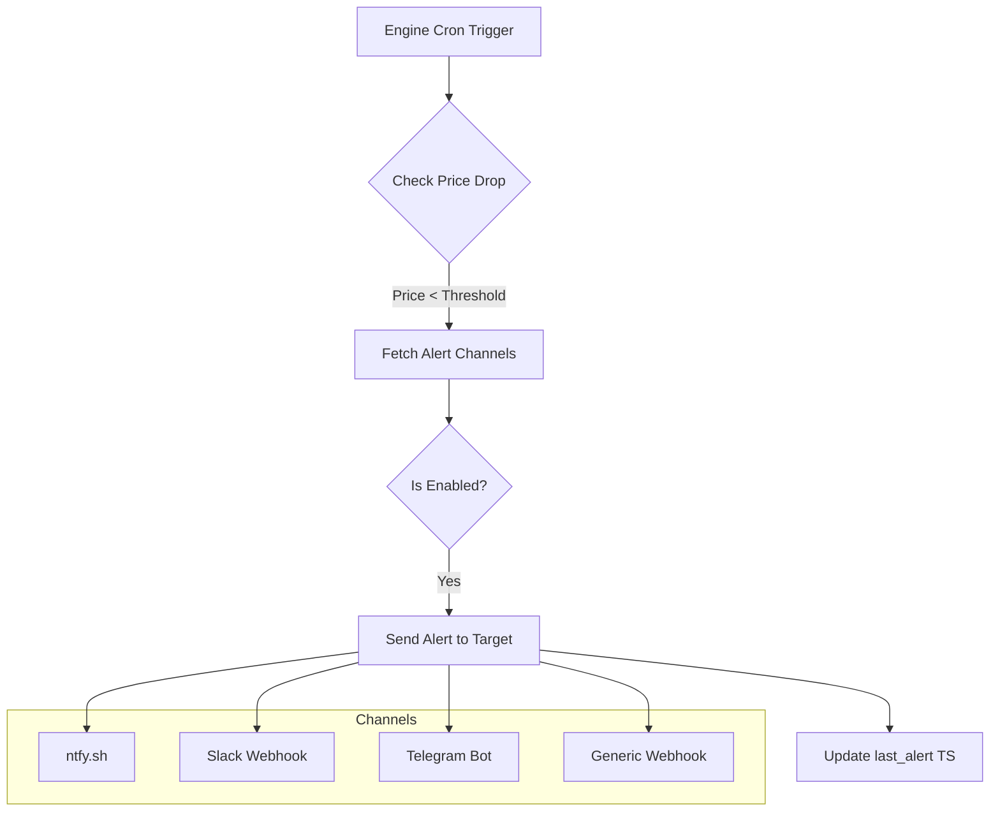
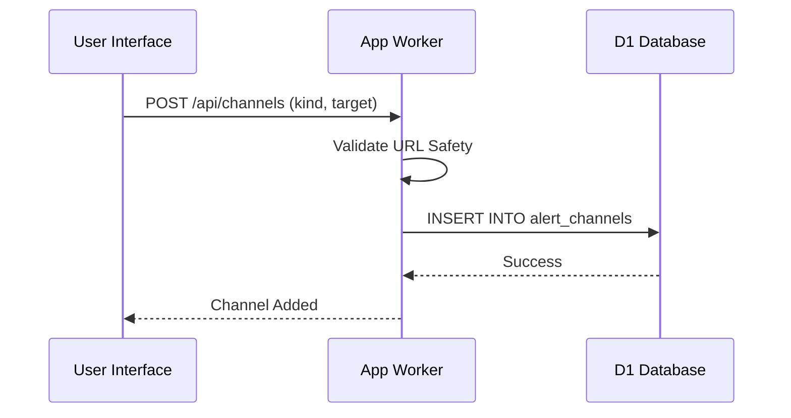

<details>
<summary>Relevant source files</summary>

The following files were used as context for generating this wiki page:

- [engine/src/index.ts](engine/src/index.ts)
- [app/src/watch.ts](app/src/watch.ts)
- [infra/schema.sql](infra/schema.sql)
- [PROPOSAL-hopslagen-app.md](PROPOSAL-hopslagen-app.md)
- [DESIGN.md](DESIGN.md)
- [app/public/app.js](app/public/app.js)
</details>

# Extending Alert Channels

Extending alert channels is a modular approach within the Product Describer project to notify users of price drops in the product catalog. These channels are account-specific and allow users to receive updates through various third-party services like Slack, Telegram, or ntfy, as well as generic webhooks. The system is designed to be extensible, allowing for the addition of new notification providers by implementing a standard HTTP-based delivery pattern.

The alerting logic is decoupled from the user interface, residing primarily in the `engine` worker. While the `app` worker handles the configuration and management of these channels, the `engine` worker’s cron trigger periodically checks for price drops and executes the dispatch to the configured targets.

Sources: [PROPOSAL-hopslagen-app.md:58-62](PROPOSAL-hopslagen-app.md#L58-L62), [DESIGN.md:33-35](DESIGN.md#L33-L35), [engine/src/index.ts:544-547](engine/src/index.ts#L544-L547)

## Architecture and Data Flow

The alert system follows a "Hearth and Muscle" architecture where Cloudflare serves as the brain (memory and logic) and external services act as the endpoints. Alert channels are stored in the D1 database and are associated with specific user accounts.

### Alerting Process Flow

The following diagram illustrates the flow from a detected price drop to a successful user notification.



The alerting process is managed by a sequential cron trigger in the `engine` worker that identifies products where the new price is lower than the previous price by a defined threshold (e.g., ≥5% and ≥100 kr).

Sources: [DESIGN.md:129-137](DESIGN.md#L129-L137), [engine/src/index.ts:544-592](engine/src/index.ts#L544-L592), [PROPOSAL-hopslagen-app.md:58-62](PROPOSAL-hopslagen-app.md#L58-L62)

## Database Schema

Alert channels and their relationships to accounts and price watches are defined in the D1 SQL schema.

### `alert_channels` Table
| Field | Type | Description |
| :--- | :--- | :--- |
| `id` | TEXT (PK) | Unique identifier for the channel. |
| `account_id` | TEXT | Reference to the owning account. |
| `kind` | TEXT | Type of channel (ntfy, slack, telegram, webhook). |
| `target` | TEXT | Configuration (URL, token, or topic). |
| `enabled` | INTEGER | Flag to toggle the channel (1 for active). |
| `created_at` | INTEGER | Unix timestamp of creation. |

Sources: [infra/schema.sql:117-124](infra/schema.sql#L117-L124)

### Related Entities
- **`price_watch`**: Tracks which products a specific account is monitoring and stores the `last_alert` timestamp to manage cooldowns.
- **`price_history`**: Provides the historical data used to detect price drops.

Sources: [infra/schema.sql:106-115](infra/schema.sql#L106-L115), [infra/schema.sql:85-89](infra/schema.sql#L85-L89)

## Implementation Details

### Channel Dispatch Logic
Notification delivery is implemented via the `sendAlert` function in the `engine` worker. It uses the standard `fetch` API to send POST requests to the various service endpoints.

```typescript
async function sendAlert(kind: string, target: string, title: string, body: string, url: string): Promise<boolean> {
  try {
    if (kind === "ntfy") {
      const r = await fetch(target, { method: "POST", headers: { Title: title, Click: url }, body });
      return r.ok;
    }
    if (kind === "slack") {
      const r = await fetch(target, {
        method: "POST",
        headers: { "content-type": "application/json" },
        body: JSON.stringify({ text: `*${title}*\n${body}\n${url}` }),
      });
      return r.ok;
    }
    // ... additional providers (telegram, webhook)
  } catch {
    return false;
  }
}
```

Sources: [engine/src/index.ts:505-542](engine/src/index.ts#L505-L542)

### Security and Validation
To prevent Server-Side Request Forgery (SSRF), the system implements a `isSafeWebhookUrl` check for URL-based channels. This validation ensures that targets use the `https` protocol and are not pointing to internal network addresses, localhost, or cloud metadata endpoints.

Sources: [app/src/watch.ts:53-78](app/src/watch.ts#L53-L78)

## Configuration Options

Alert thresholds and behavior are governed by environment variables in the `engine` worker.

| Variable | Description | Default |
| :--- | :--- | :--- |
| `ALERT_MIN_DROP_PCT` | Minimum percentage drop required to trigger an alert. | 5% |
| `ALERT_MIN_DROP_KR` | Minimum currency (kr) drop required to trigger an alert. | 100 kr |
| `ALERT_COOLDOWN_HOURS` | Time to wait before alerting again for the same product. | 24 hours |

Sources: [engine/src/index.ts:49-51](engine/src/index.ts#L49-L51), [engine/src/index.ts:545-547](engine/src/index.ts#L545-L547)

## User Interface and Management

The front-end allows users to add and remove channels via a dedicated "Larmkanaler" section.



Management features include:
- **Validation**: ntfy, Slack, and generic webhooks are checked for URL safety before being saved.
- **Bulk Operations**: Users can watch entire categories or search results, which increases the potential volume of alerts managed by the configured channels.

Sources: [app/public/app.js:510-541](app/public/app.js#L510-L541), [app/src/watch.ts:80-101](app/src/watch.ts#L80-L101), [PROPOSAL-hopslagen-app.md:50-52](PROPOSAL-hopslagen-app.md#L50-L52)

## Summary
The "Extending Alert Channels" feature provides a modular, secure, and scalable way for users to receive notifications about catalog changes. By centralizing the logic in the `engine` worker's cron job and using the `alert_channels` table for provider-agnostic storage, the system can easily support additional notification services in the future with minimal code changes.
